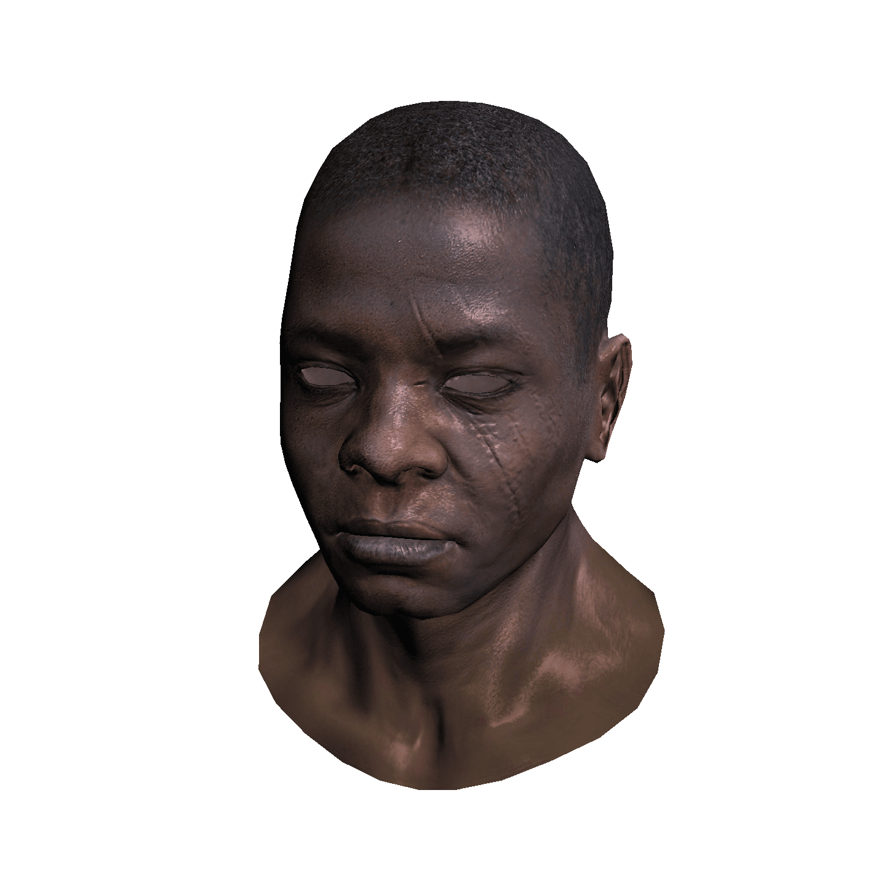
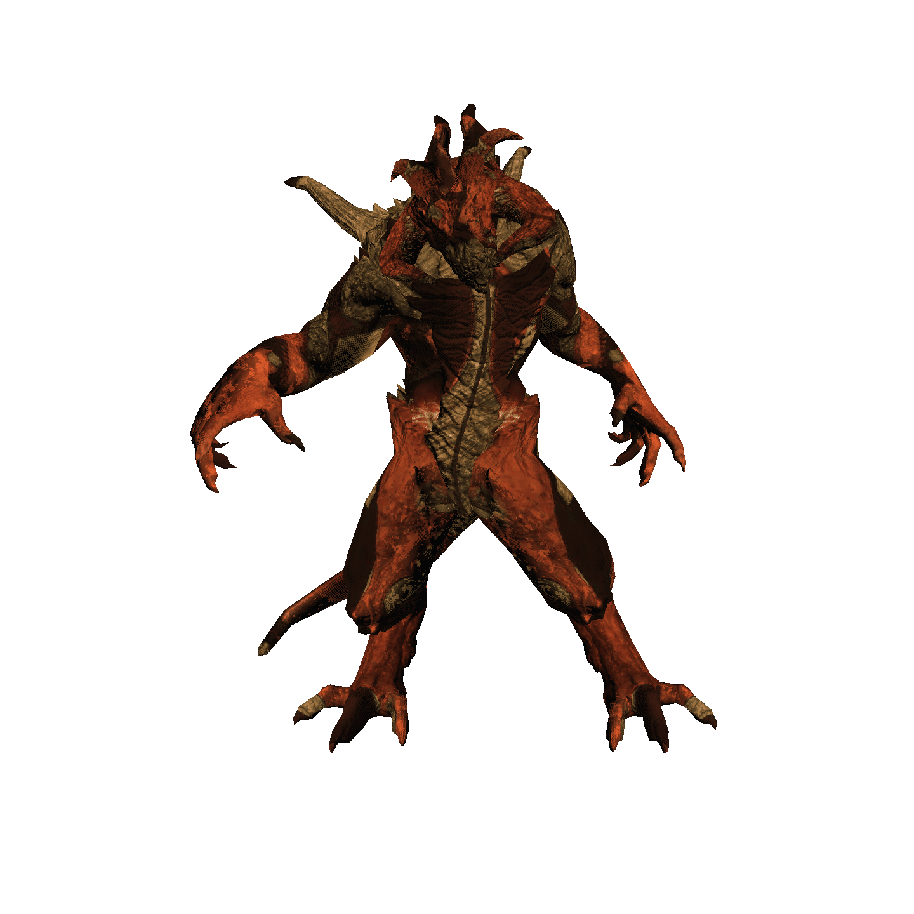
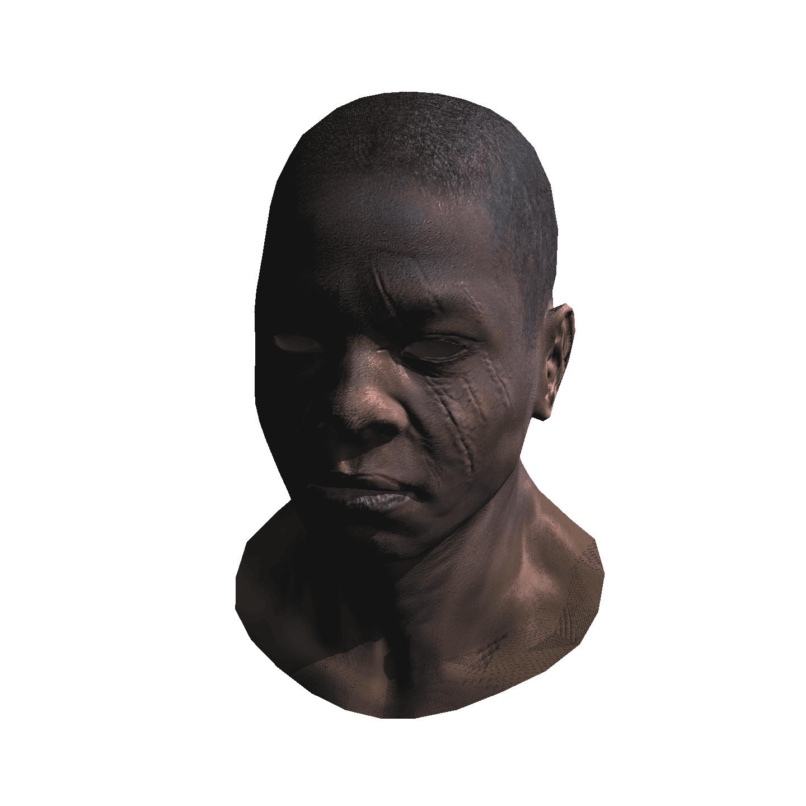
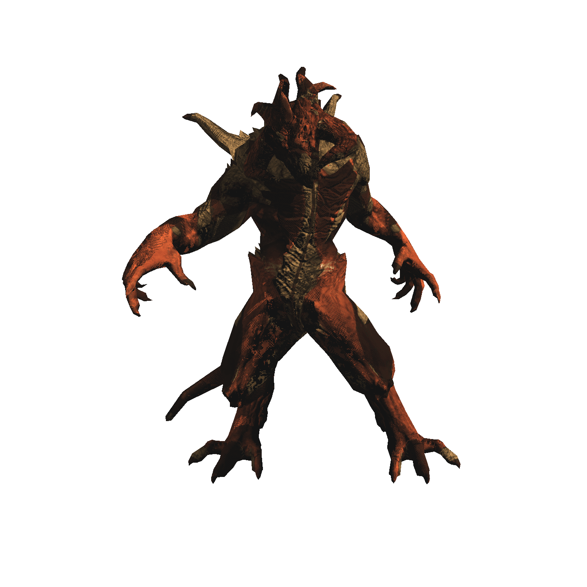

# renderer

Me learning computer graphics by cloning [ssloy/tinyrenderer](https://github.com/ssloy/tinyrenderer)

## TODOS

|items|status|
|-----|------|
|Rewrite codebase in C++|W|
|try conan packge manager|W|
|switch tinytga to stb|W|
|~~Add ambient occlusion~~|N|

## Demo

Phong shading

|||
|------------|-------|
|african_head|diablo3|

Shadow

|||
|------------|-------|
|african_head|diablo3|

